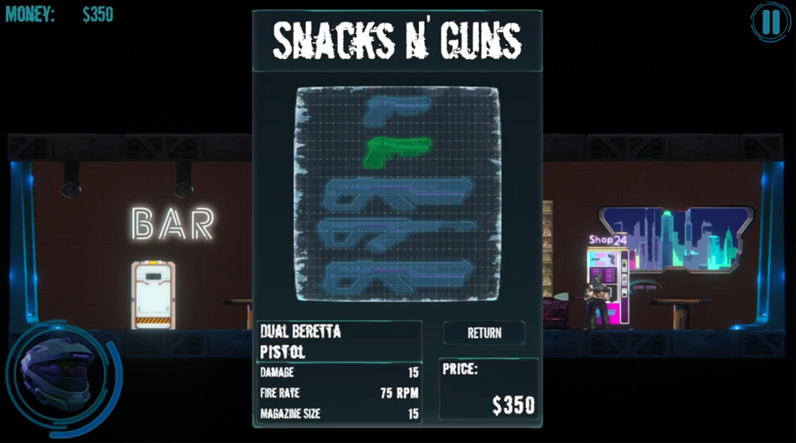
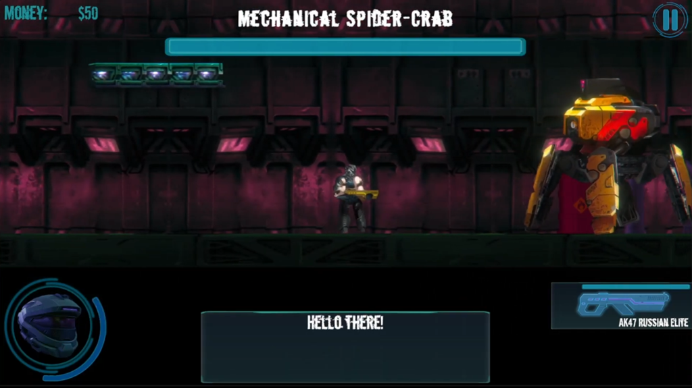

# ROG4Creators

**A 2D cyberpunk action-platformer made in Unity for the #ROG4Creators contest.**

▶️ **[Watch the gameplay presentation on YouTube](https://youtu.be/2tFgNclXQYk)**

---

## About the game

You play as **Rog**, a wandering gunslinger who arrives in yet another nowhere town looking for something to drink. It doesn't take long before he's pulled into local trouble: a missing robot lost in the underground, waves of hostile machines, and a giant spider‑crab that threatens to destroy the whole city.

The game combines side‑scrolling platforming, run‑and‑gun shooting and a short, dialogue‑driven quest line across three locations: **the City**, **the Bar** and **the Underground**.

## Features

- **Story quest line** – 8 objectives guided by NPC dialogues (the Barmaid, Vlad the guard and a rescued robot), with a quest pointer that always shows where to go next.
- **Wave survival** – fight through 3 waves of enemies spawning from both sides of the arena.
- **Boss fight** – a giant spider‑crab walker with its own health bar, camera change and dynamic music transition.
- **Weapon vending machines** – spend money on weapons that materialise with a teleport shader effect.
- **Two weapon slots** – swap between weapons, manage magazines and reload.
- **Several enemy types** – walkers, flying spheres, cannons, spikes and wave variants.
- **Juice** – damage popups, impact and death effects, parallax background, rain, animated portals, typewriter‑style dialogues with voice lines.
- **Keyboard and gamepad support** via the new Input System.

---

  
  &nbsp;
  

---

### Weapons

| Name | Type | Damage | Fire rate (s) | Magazine | Price |
|---|---|---|---|---|---|
| CZ75 Kretek | Pistol | 25 | 0.5 | 10 | 150 |
| Dual Beretta | Pistol | 15 | 0.8 | 15 | 350 |
| WD40 Lubricator | Shotgun | 25 | 0.4 | 2 | 700 |
| AK47 Russian Elite | Machine gun | 5 | 0.1 | 30 | 1000 |
| AR29 Terminator | Machine gun | 5 | 0.1 | 30 | 1200 |

Weapons are defined as ScriptableObjects, so new ones can be added without touching code.

## Controls

| Action | Keyboard | Gamepad (Xbox) |
|---|---|---|
| Move | `A` / `D` | Left stick |
| Jump | `Space` | `A` |
| Shoot | `Ctrl` | `RT` |
| Swap weapon | `Q` | `LT` |
| Interact (talk, pick up, doors, vending machine) | `E` | `X` |
| Reload | `R` | `LB` |
| Pause menu | `Esc` | `Start` |

## Tech stack

- **Unity 2021.2.2f1**
- **Universal Render Pipeline (2D Renderer)** with 2D lights
- **Shader Graph** – laser beam and teleport/dissolve shaders
- **Input System** – generated `InputControls` class, keyboard + gamepad
- **Cinemachine** – follow camera and boss‑fight camera
- **Timeline** – intro sequence
- **2D Animation, PSD Importer, Tilemap, Tilemap Extras, Pixel Perfect Camera**
- **TextMeshPro** – UI and dialogues

## Code overview

All gameplay scripts live in `Assets/Scripts`.

| Area | Scripts |
|---|---|
| Player | `CharacterController2D`, `PlayerManager`, `WeaponManager` |
| Weapons | `Weapon`, `WeaponObject` (ScriptableObject), `Bullet`, `VendingMachine`, `VendingMachinePanel` |
| Enemies | `EnemyWalker`, `EnemyWalkerBoss`, `EnemySphere`, `EnemyCannon`, `EnemyWave`, `Spikes` |
| Game flow | `QuestManager`, `QuestPointer`, `WaveManager`, `BossEvent`, `DialogManager`, `NPC` |
| World | `Door`, `Portal`, `Elevator`, `Platform`, `HealItem`, `ParallaxScrolling` |
| UI & audio | `UserInterface`, `MainMenu`, `PauseMenu`, `EndGameMenu`, `FloatingPoints`, `SoundManager` |

A few design choices:

- **Interfaces** – `IDamageable<T>` for anything that can take damage (player and enemies), `IDoor` for doors and portals.
- **Singleton managers** – `QuestManager`, `DialogManager`, `SoundManager` and `UserInterface`.
- **ScriptableObjects** for weapon data.
- **MaterialPropertyBlock** to drive per‑instance shader effects (weapon spawn) without creating new materials.

## Credits

- **Design & programming:** [Antecki123](https://github.com/Antecki123)
- Game created for the **#ROG4Creators** contest by ASUS Republic of Gamers. Graphic assets partly provided by the contest organisers.
